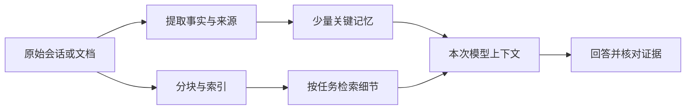

# 第三章学习笔记：记忆、知识库与检索

学习日期：2026-09-19。根据[第三章原文](https://github.com/bojieli/ai-agent-book/blob/main/book/chapter3.md)与本次真实运行整理。AI 辅助实验和写作。

**本次完成的是覆盖 12 个实验主题的缩小机制实验，不是原书 12 项验收全部通过。**原书要求的 60 个记忆用例、独立模型评委、Intel 完整资料与真实司法数据集没有完整复现。详见[实验结果与边界](09-chapter3-experiment-evidence.md)。

## 1. 我先抓住这条主线

第二章研究当前对话里应该给模型看什么；第三章进一步研究：对话结束后留下什么，下次又如何找回来。

结合前面的库存实验，我现在把系统分成三件事：原始记录负责留证，长期记忆负责保留少量重要事实，检索负责从大量资料中找细节。最终回答仍然依赖本次真正发给模型的信息。文件已经存到磁盘，不等于模型已经知道里面有什么。

这里的“记忆”存放在外部数据结构中，通常并没有改写模型参数。它要经历提取、保存、读取和更新，每一步都可能出错。

## 2. 接着我们之前的讨论修正理解

我之前认为应该保留“稳定信息”。现在需要补充：稳定偏好值得保留，**短期但仍有效的承诺、状态和依赖关系也可能非常重要**。例如默认中文输出可以长期保存；当前有效合同、项目开工日期、证件到期日期则必须连同时间和状态保存。

“库存、日耗和采购交期”足够计算缺口，但还需要料号、项目、数据时间和来源，才能确认这些数值属于同一个对象。两个项目都使用同一个料号，并不意味着库存可以混用。

对于“数据够多，模型就能从结果猜回原始方向”的想法，我现在更谨慎：同一组数据可以用于采购、成本分析、异常检测等不同任务。更多相似样本不必然消除任务歧义。目标、约束和判断标准仍应明确保留，而不是让模型猜。

## 3. 记忆格式：复杂结构不自动带来更准确的答案

实验 3-1/3-2 使用六个合成案例，每个两段会话，三层能力各两个：基础事实与更新、多对象与有效合同、主动发现限制。四种格式都采用同一模型、同一案例。

每次更新只接收“旧记忆＋新会话”；回答阶段只提供最终记忆和新问题，不回传原始历史。

| 格式 | 预设检查通过 | 平均最终记忆长度 |
|---|---:|---:|
| 原子事实列表 | 6/6 | 115 字符 |
| 叙述段落 | 6/6 | 104 字符 |
| 普通 JSON | 6/6 | 236 字符 |
| 带主体、来源和状态的卡片 | 6/6 | 839 字符 |

这些是规则检查结果，不是独立评委得分，也不代表所有回答细节完全正确。本次短会话没有拉开准确率差距，复杂卡片却明显更长。不能据此得出“卡片无用”，也不能把教材中的优势直接写成本次发现。

我的工程理解是：优先保留实体、时间、来源和有效性，再选择能承载这些信息的格式。普通列表如果写得清楚，也可能处理短案例；规模扩大后，更新、检索和消歧才更容易暴露结构差异。

## 4. 脱敏：本地运行解决不了检测错误

实验 3-3 在本机运行 Qwen3-0.6B，使用三条合成日志，共四处标注敏感字符串；没有把这些日志送到云端脱敏。

正则识别了邮箱和电话，漏掉口令与地址。小模型同样漏掉后两项，还把订单号、错误码、温度等业务信息判成敏感内容。直接合并正则与模型结果，保留了这些误报。

这让我理解了两类独立要求：数据在哪里处理，以及处理得对不对。本地部署有助于控制数据去向，但仍需测漏检、误报、格式是否合法，以及脱敏后还能不能排障。本次结果不支持“用了 LLM 就更安全”。

## 5. 检索要分清：找得快、找得像、找得对

实验 3-4 用同一嵌入模型生成 2,000 条合成记录的向量，对 65 个查询比较近似索引与精确搜索。Annoy 的 Recall@10 为 86.92%，Faiss HNSW 为 90.92%。这是向量邻居召回率，不是业务答案正确率。

实验 3-5 从零实现 BM25，并核算书中示例：四篇文档得分约为 3.665、1.684、1.224、0.824，排序与示例一致。料号和错误码适合用精确匹配保住；换成同义表达，纯关键词检索可能完全没有命中。

实验 3-6 对 12 条合成资料、8 个固定查询比较：

| 方法 | Recall@3 | MRR |
|---|---:|---:|
| BM25 | 62.5% | 0.625 |
| 稠密向量 | 87.5% | 0.803 |
| RRF 融合 | 87.5% | 0.803 |
| 分数归一化融合 | 87.5% | 0.803 |
| 融合后神经重排 | 87.5% | 0.803 |

本次重排没有增加收益。中文“芯片复位”查询也没有被所选英文模型可靠处理。工具链更长不保证更好；模型语言适配、语料与查询质量都需要检查。

还发现一个评分陷阱：BM25 对“kitty”没有词面命中时，全零分文档如果仍按原顺序返回，恰好排在第一篇的猫文档会变成假命中。最终评分已排除零分候选。

## 6. 结构化索引与多次检索解决不同问题

实验 3-7 用七条虚构工程事实，让模型分别生成层级摘要和关系边。两种索引都能支持回答传感器到电机的路径：

`SNS-17 → ADC-42 → MCU-83 → DRV-56 → MOT-19`

图索引的引用能直接对应 e3/e4/e6/e7 四条关系；摘要答案引用了更宽泛的来源组。这只是小型结构表达演示，没有实现完整 RAPTOR 聚类树、GraphRAG 社区摘要或大型手册检索。

实验 3-8 回到库存。一次检索只取得项目映射等资料，缺库存与交期，模型明确回答“无法判断”；允许 Agent 再查后，找齐三条依据，算出库存可用 3 天、缺口 4 天。

一次检索的拒答没有编造数值，应视为证据不足时的合理行为。本例说明迭代检索可以补齐资料，不能推出它在所有任务里都比一次检索更优。

## 7. 前缀补什么，比有没有前缀更关键

实验 3-10 将六段合成公司资料分别建成普通块和带模型生成前缀的块。普通正文只写增长百分比，丢掉了公司、年份。加回这些身份信息后，六个查询的 Top-1 命中从 BM25 的 1/6、向量的 0/6，提高到两者均 6/6。

这是故意构造的上下文缺失样本，不是现实知识库改善幅度的估计。普通组偶然命中某条记录，也不能说明它真的知道公司身份。

实验 3-9/3-11 用四条合成历史检查有效合同与项目准备：孤立块能留下“9 天”，却丢了供应商。带前缀后能够回答当前合同属于 South，排除未接受的旧报价。

最有价值的失败出现在项目 Vega：原文说它依赖 CERT-71，证件会在开工前到期。第一版前缀保留了项目名与日期，却漏掉依赖关系，Agent 因此没有发现风险；补充常驻概览卡片后才给出提醒。

我又追加了一个诊断对照：只要求前缀明确保留依赖关系，不增加常驻卡片。它也成功找到证件并提醒续期。因此本次证据支持的是“关键关系必须保留”，不能用它证明“双层架构必然优于前缀检索”。这次追加是看到失败后设计的，不冒充预先注册的实验。

另外，失败回答把“提前准备”误解成“开工必须迫近”，无依据地质疑用户前提。检索缺资料时，也要防止模型把自己的理解偏差说成用户的问题。

## 8. 从资料提炼规律，也要保留适用边界

实验 3-12 改成合成工程故障资料：24 条训练记录中，模型发现电压、温度、连接器状态三个因素；随后提取数值，进行标准化与三类聚类。六条未参与拟合的特征样本分别落入预期类别。

这里类别本来就是人为分离构造的，而且没有真实故障验证。它展示了“文本→因素→结构化特征→原型”的流程，不能证明模型发现了真实因果规律，更不是原书司法预测结果。诊断建议最终还需要现场测量验证。

## 9. 这章留给我的实践原则

- 对每条重要事实问清：属于谁、什么时候有效、依据是什么。
- 任务目标与关键约束常驻；大量细节按需检索。
- 旧合同、旧库存、旧偏好不能与新记录无差别混用。
- 评估分开看提取、检索、回答和引用，失败时才知道该改哪里。
- 对检索之外的原始记录保留追溯能力；摘要无法还原的内容要能重新取回。
- 笔记中的“稳定偏好”只是学习理解，不会因此自动改写本机真实长期记忆。

我现在更愿意把好的记忆系统理解成：在需要的时候，找回正确对象的有效事实，并让答案可以追溯。记得更多只是其中一个条件。

## 参考与继续练习

- [第三章正文](https://github.com/bojieli/ai-agent-book/blob/main/book/chapter3.md)
- [原书逐项验收条件](https://github.com/bojieli/ai-agent-book/blob/main/chapter3/EXPERIMENT_LEDGER.md)
- [本次数据、模型与未覆盖项](09-chapter3-experiment-evidence.md)

下一步适合在固定测试集里增加同名项目、过期合同、相互矛盾的数据，以及前缀容易漏掉的依赖关系；先补强评分与证据，再考虑更大的索引和更多工具。
